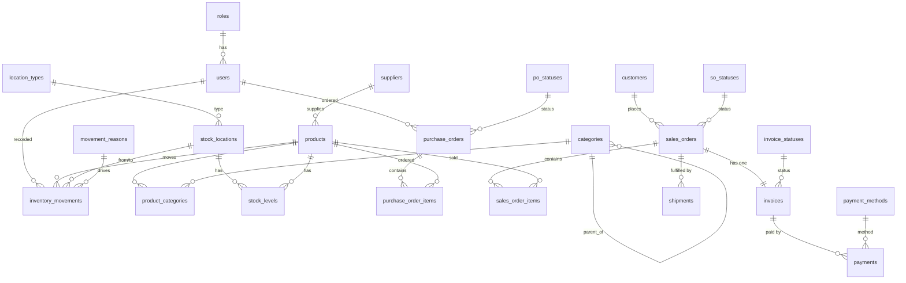

# Retail Inventory & Order Management (MySQL)

A clean, teaching-friendly MySQL schema for a small retailer to manage products, suppliers, stock levels, purchasing, sales, invoicing, payments, and shipments.

## What it does

- Tracks products, suppliers, customers, and users
- Manages purchase orders and receipts
- Manages sales orders and shipments
- Keeps stock levels per location
- Records every inventory movement for audit
- Demonstrates relationships:
  - 1-1: `sales_orders` ↔ `invoices` (same PK, FK back to `sales_orders`)
  - 1-M: `suppliers` → `products`, `customers` → `sales_orders`
  - M-M: `products` ↔ `categories` via `product_categories`

## How to run / import

1. Make sure you have MySQL 8.0+.
2. Open a terminal and run:
   ```sh
   mysql -u <user> -p < inventory_db_mysql.sql
   ```
3. The script creates a database named `retail_inventory` and all tables, plus seed data in lookup tables.

## ERD (Mermaid)

> You can paste this into a Mermaid-enabled Markdown viewer (or GitHub with a mermaid block).



## Folder structure

```
/
├─ inventory_db_mysql.sql   # The schema (CREATE TABLE statements only)
└─ README.md                # This file
```

## Notes

- All tables use InnoDB and utf8mb4.
- CHECK constraints require MySQL 8.0.16+.
- Adjust database name if you prefer a different one.
```

